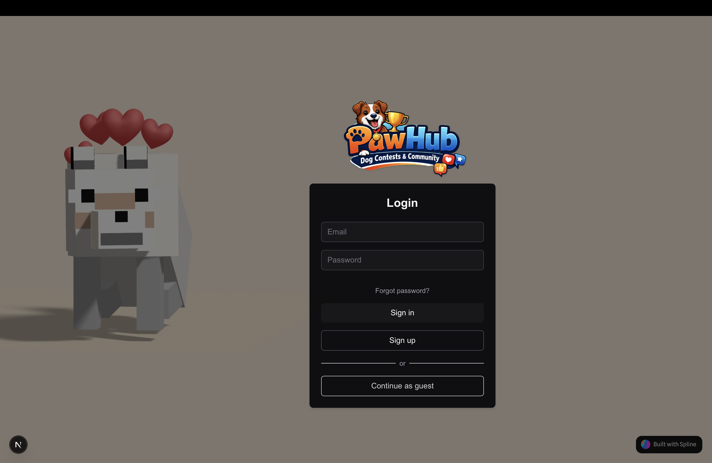
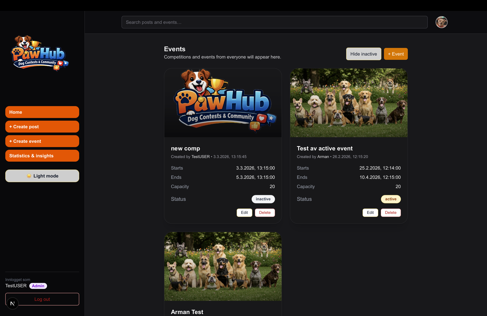
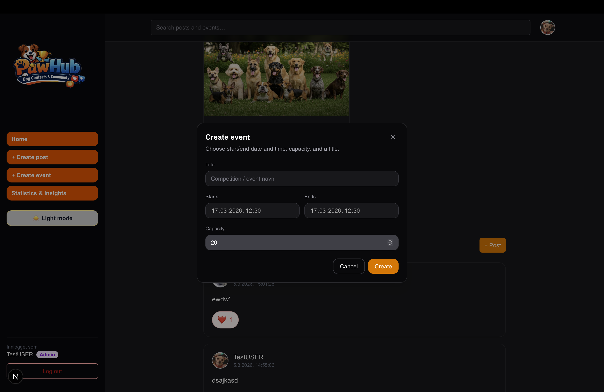
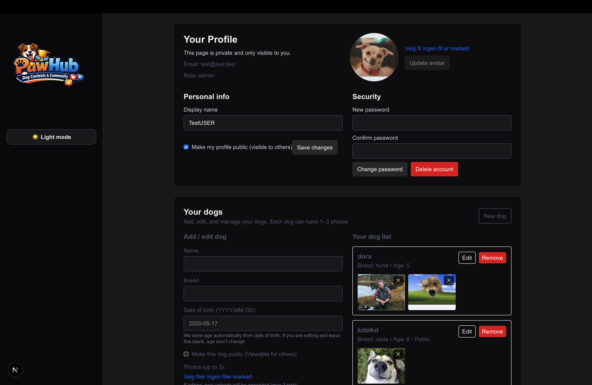
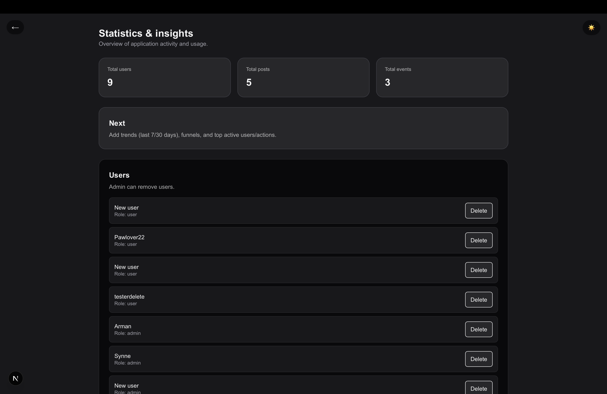
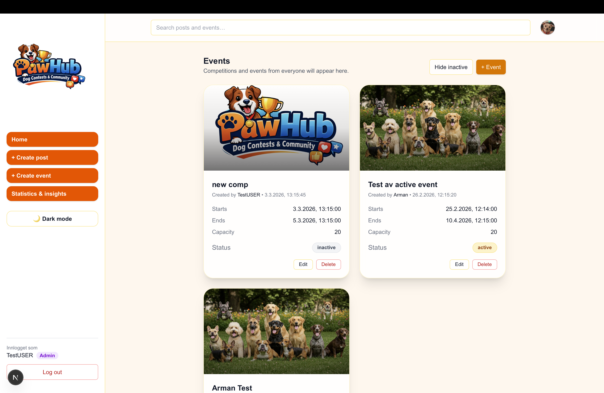

# PawHub (Group 21)

PawHub is a social platform for dog owners. Users can create profiles, share posts, join competitions, and interact through likes and comments. Admins can moderate content and manage users.

## Team

- Marie
- Synne
- Asish
- Arman
- Kristian

## Repository Layout

This repository contains one main app:

- `pawhub/`: Next.js app (App Router), Supabase integration, tests

Most commands in this README are run from `pawhub/`.

## Core Features

- Email-based authentication (Supabase Auth)
- User and dog profile pages
- Competition participation (join/leave)
- Likes and comments on competition content
- Post likes and interactive feed components
- Admin dashboard and admin-only moderation routes
- Password reset / forgot-password flow

## Tech Stack

**Framework:** [Next.js 16](https://nextjs.org) and [React 19](https://react.dev)

**Language:** TypeScript

**Styling:** Tailwind CSS 4

**Backend:** Supabase (`@supabase/supabase-js`, `@supabase/ssr`)

**Testing:** Vitest and Testing Library

## Prerequisites

- Node.js 20+
- npm 10+
- A Supabase project with configured auth/database/storage

## Quick Start

1. Go to the app directory:

```bash
cd pawhub
```

2. Install dependencies:

```bash
npm install
```

3. Create `pawhub/.env.local`:

```env
NEXT_PUBLIC_SUPABASE_URL=your_supabase_project_url
NEXT_PUBLIC_SUPABASE_ANON_KEY=your_supabase_anon_key
SUPABASE_SERVICE_ROLE_KEY=your_service_role_key
```

4. Start development server:

```bash
npm run dev
```

5. Open `http://localhost:3000`.

## Environment Variables

- `NEXT_PUBLIC_SUPABASE_URL`: Supabase project URL (client/server use)
- `NEXT_PUBLIC_SUPABASE_ANON_KEY`: Public anonymous key (client/server use)
- `SUPABASE_SERVICE_ROLE_KEY`: Server-only key used by protected API routes

Important:

- Never expose `SUPABASE_SERVICE_ROLE_KEY` to the browser.
- Keep `.env.local` out of version control.

## Available Scripts

Run in `pawhub/`:

- `npm run dev`: Start local development server
- `npm run build`: Build production bundle
- `npm run start`: Start production server
- `npm run lint`: Run ESLint
- `npm run test`: Start Vitest in watch mode
- `npm run test:run`: Run tests once (CI-friendly)

## Testing

The project includes unit and integration-style tests for routes, auth permissions, and major UI flows.

```bash
cd pawhub
npm run test:run
```

Test files are located under `pawhub/__tests__/`.

## Supabase Notes

App behavior depends on correct Supabase setup:

- Required tables and relationships
- Correct RLS policies for user/admin actions
- Auth providers and redirect URLs
- Any buckets used by the app

If pages load but data is missing, verify environment values and RLS rules first.

## Project Structure

```text
group-21/
|-- README.md
`-- pawhub/
    |-- app/
    |-- lib/
    |-- __tests__/
    |-- supabase/
    |-- package.json
    `-- README.md
```

## Screenshots









**Image 1:** Login page

**Image 2:** Main page

**Image 3:** Create Event

**Image 4:** Profile page

**Image 5:** Statistics&insights page

**Image 6:** MainPage in light mode